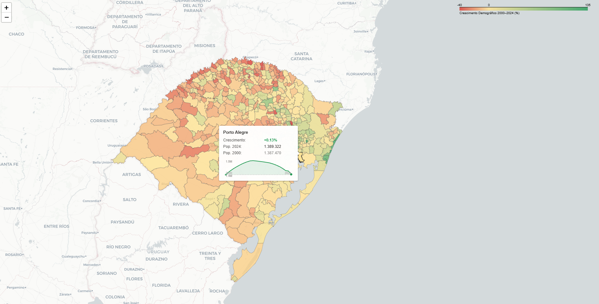

# Relatório

> [!CAUTION]
>
> - Você <ins>**não pode utilizar ferramentas de IA para escrever este relatório**</ins>.

## Identificação

- **Nome**: <mark>`Caio Felipe Ferreira Nunes`</mark>
- **Cartão UFRGS:** <mark>`00588024`</mark>

## Dados utilizados

> [!IMPORTANT]
>
> - Os dados utilizados devem ser informados como **links** para as fontes originais.
> - Se houver mais de um conjunto de dados, liste todos separadamente.
> - Para cada conjunto de dados, inclua também uma **descrição curta** explicando os dados.

1. **Dataset 1**: <mark>`https://dados.rs.gov.br/dataset/dee-5209`</mark>
    * **Descrição curta**: <mark>`Demografia - População - Estimativas Populacionais - RIPSA - Total`</mark>
2. **Dataset 2**: <mark>`https://www.ibge.gov.br/geociencias/organizacao-do-territorio/malhas-territoriais`</mark>
    * **Descrição curta**: <mark>`Malha dos municipios do Rio Grande do Sul em JSon, usada para criação de heatmap do crescimento demografico de cada cidade`</mark>
3. ...

## Código-fonte da visualização

> [!IMPORTANT]
>
> - Indique abaixo onde está, dentro deste repositório, o código-fonte usado para gerar a visualização.

- **Arquivo principal**: [./Visualization.py](Visualization.py)
- **Arquivos complementares (se houver)**: [./Sparkline.js](Sparkline.js) , [./datas/*.json](./datas)

## Imagem da visualização gerada

> [!IMPORTANT]
>
> - Insira aqui uma imagem da visualização criada por você. Troque `imagem-da-visualizacao.png` pelo caminho correto do arquivo no repositório. 
> - Se você criou alguma visualização interativa, então descreva aqui como acessá-la. Por exemplo, se for uma página HTML, coloque o link, ou se for uma visualização 3D, descreva como compilar e executar o código. 

Ao executar o Visualization.py ele ira gerar um html([mapa_crescimento_demografico.html](mapa_crescimento_demografico.html))
## Descrição da visualização

### Legenda (*caption*)

> [!IMPORTANT]
>
> - Escreva um texto curto explicando como interpretar a visualização. Descreva os elementos visuais, eixos, cores, símbolos ou interações relevantes.
> - Este texto seria a legenda (*caption*) que acompanharia a figura em uma publicação, por exemplo.

Figura — Crescimento demográfico dos municípios do Rio Grande do Sul, 2000–2024 (Fonte: IBGE e DADOS RS).
Cada município é colorido conforme sua variação populacional no período: tons verdes indicam crescimento, tons vermelhos indicam declínio e o amarelo marca estabilidade. Ao passar o cursor sobre um município, um painel exibe a população nos anos extremos e um pequeno gráfico com a evolução anual ao longo dos 25 anos.

### Conclusão demonstrada pela visualização

> [!IMPORTANT]
>
> - Escreva uma conclusão curta sobre os dados com base na visualização.
> - Explique qual insight, padrão ou tendência pode ser observado.

Inicialmente, a ideia foi criar uma visualização em formato de barras horizontais
mostrando os 20 municípios com maior crescimento e os 20 com maior encolhimento
ao longo dos 25 anos. Porém, após criar a visualização ([Código Fonte](OldVisualization.py)
e [Visualização Antiga](grafico_populacao_rs.png)), percebeu-se que boa parte dos
municípios com maior crescimento estava na região litorânea do RS, e o encolhimento
concentrado em cidades rurais e de divisa com outros estados/países.

Isso motivou a [visualização final](Visualizacao.png) apresentada acima. Entre 2000
e 2024, o Rio Grande do Sul apresenta um padrão claro de concentração populacional:
as regiões metropolitana e litorânea crescem expressivamente, enquanto o interior
rural — especialmente o norte e o noroeste — perde habitantes de forma consistente.
Mais da metade dos municípios gaúchos (269 de 497) registrou declínio populacional
no período, com a mediana de crescimento ligeiramente negativa (−1,6%).

Isso reflete um movimento estrutural de urbanização e êxodo rural ainda em curso
no estado: a população se desloca em direção aos grandes centros e às cidades
costeiras, esvaziando municípios menores que dependem da agricultura familiar. O
fenômeno tende a se intensificar com o envelhecimento da população rural, sugerindo
desafios crescentes para a provisão de serviços públicos nessas localidades nas
próximas décadas.
